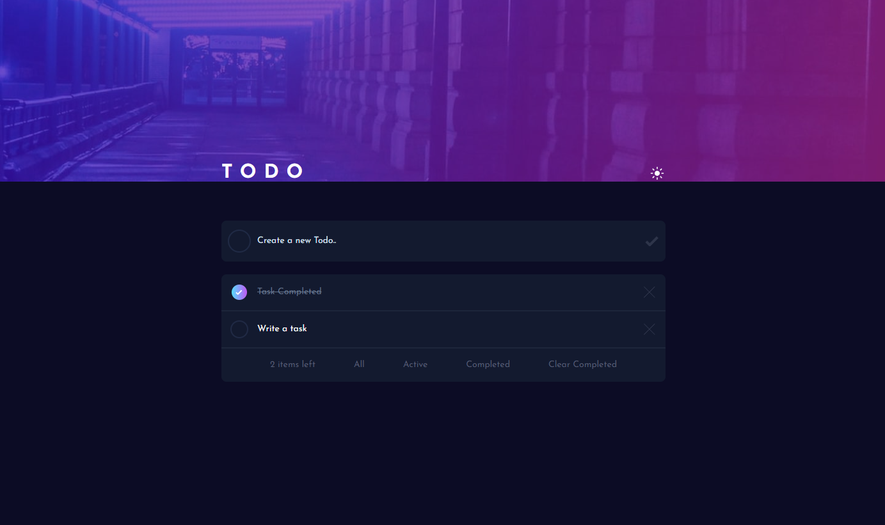

# TodoApp
A ToDo List where you can jot down your daily activities. You can add, delete, filter, and mark them as completed. The design was created using [Frontend Mentor](https://www.frontendmentor.io/challenges), while all the logic was developed by me.

# Technologies Used
- HTML
- CSS (with Tailwind CSS)
- React.js

# Installation
To get started with this project, follow these steps:
- Use `git clone https://github.com/JvTadeo/ToDo.git` to clone this repository.
- Once you have cloned the project, navigate to the project directory: `cd todo-app`
- Next, you need to install the project dependencies. Run the following command: `npm install`
- Now, simply run `npm run dev` to start the server.

Now you're all set up and ready to use the project

# Images

